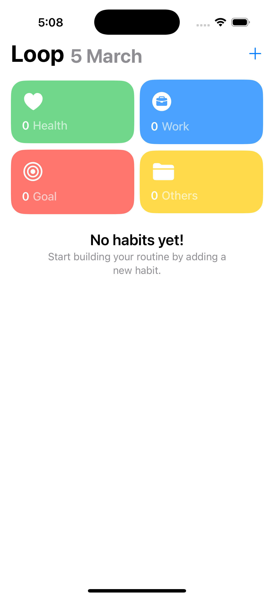
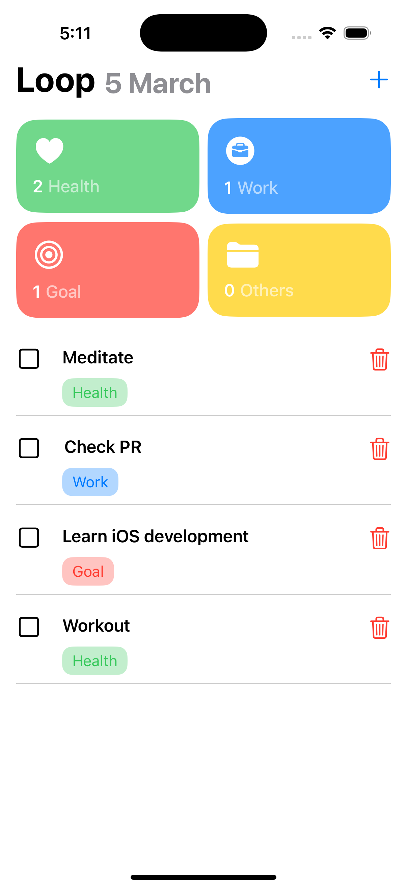
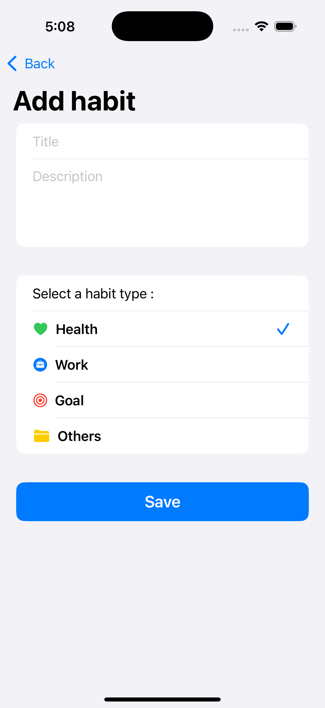
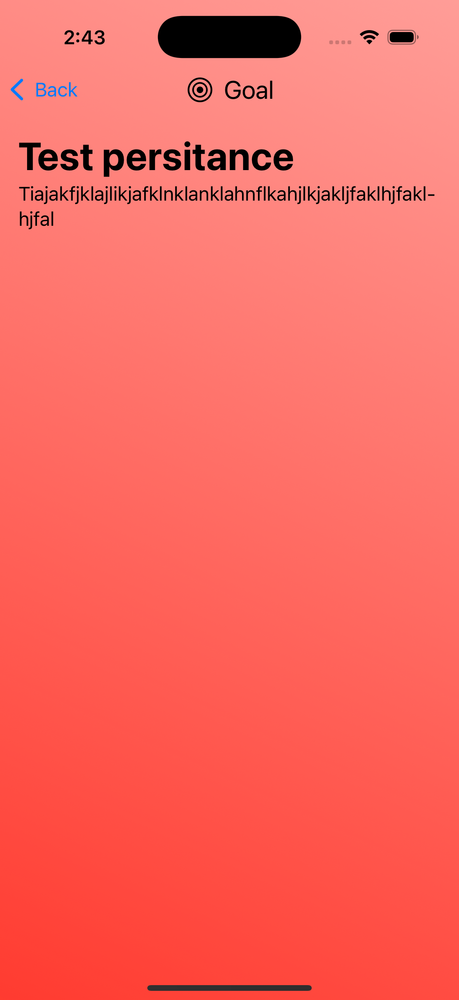
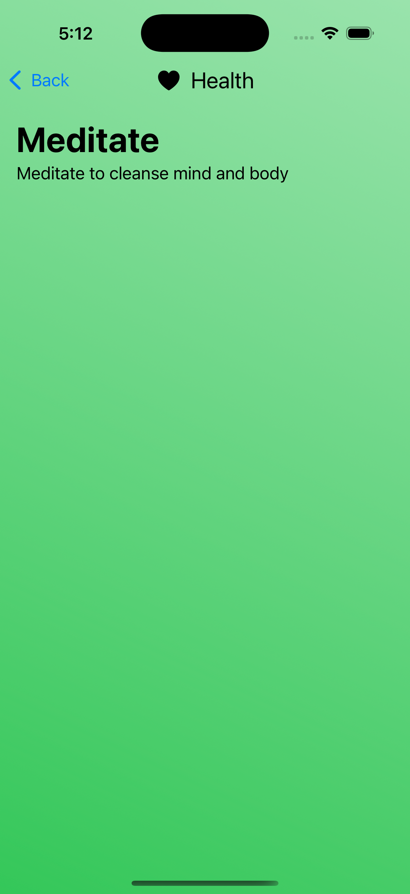
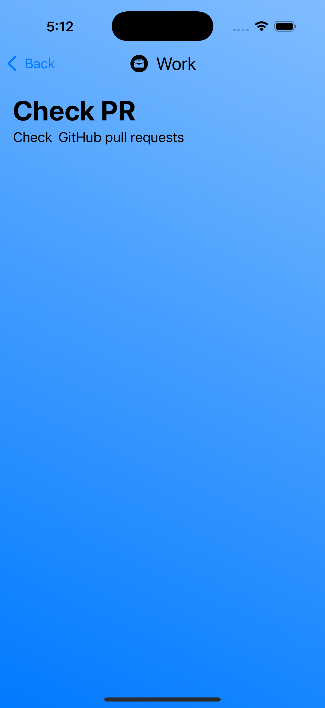

# 📱 Loop - Habit Tracker App

Loop is a habit-tracking app built using **SwiftUI** to help users build and maintain good habits. It features a clean UI, smooth animations, and detailed tracking.

## 📷 Screenshots

### 🏠 Empty Home Screen

### 📌 Filled Home Screen

### ➕ Adding a Habit

### 🎯 Goal Detail View

### 🏋️‍♂️ Health Detail View

### 💼 Work Detail View

---

## ✨ Features

✅ **Track Your Habits** – Add and manage daily habits easily.  
✅ **Progress Visualization** – View habit streaks and progress over time.  
✅ **Categorization** – Organize habits into different categories (Work, Health, Goals).  
✅ **Minimal UI** – Simple and elegant design with smooth animations.  
✅ **Data Persistence** – All habits are saved locally using Core Data.  

